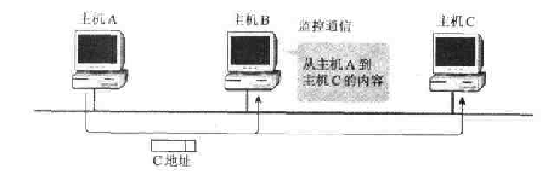
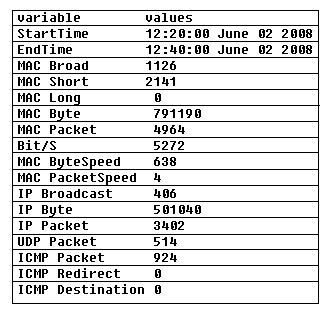
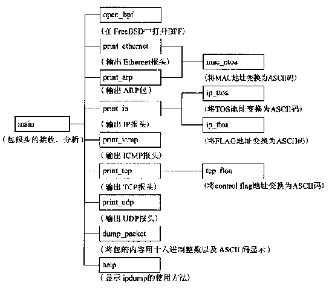
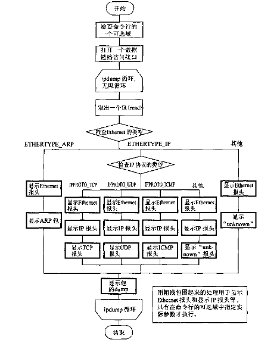
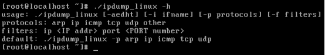
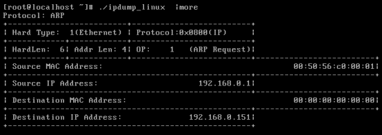
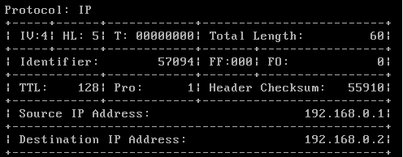
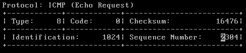

**环境**

Linux操作系统

**原理**

1. 包监控及其意义

如图1.1所示，我们把监视或查看计算机网络中传输的包的操作称为“包监控”。我们不仅能监视并查看到达自己主机的包或广播式包，而且还能够监视并查看到达其他主机的包。

`				       `图1.1 包监控

数据包监控软件正被应用计算机网络的管理人员或编制计算机网络应用程序的人员所利用。使用数据包监控软件，可以检查计算机网络的设置是否正确。在发送出现故障时，这些工具对于隔离问题并查明原因是非常有帮助的。另外，在编制计算机网络应用程序的时候利用这些工具，可以观察应用程序的运行和包的传输情况，可以调整程序，也可以学习协议的操作。进一步地讲，为了提供计算机网络的安全性，利用数据包监控软件能够检查出计算机网络的非法入侵或扫描，而且还能够检查出是否有人进行DoS攻击或非法地传输一些包等。

1. 无差别方式

在市场上销售的NIC或设备驱动程序，大多数都不删除其他主机地址的帧，他们都具有由上一层传输数据的功能。我们把这个方式称为无差别(promiscuous)方式。所谓promiscuous，表示的是“无顺序、无差别”的意思，即使MAC地址变化也没有区别，NIC能够接收包的含义。如果采用promiscuous方式，那么，由于有加重CPU负担的可能，所以通常都不采用。但是，在要监控接收端MAC地址变成其他主机的包时，必须采用promiscuous方式。

在Linux系统中，使用ifconfig命令可以改变为promiscuous方式，可以输入

ifconfig 接口名 promisc

在不采用promiscuous方式的时候，可以使用

ifconfig 接口名 –promisc

1. 数据链路访问接口的定义

为了能够直接处理来自应用程序的Ethernet等包，使用了数据链路访问接口。在普通的应用程序中，通过一个套接字接口，能够处理TCP协议或UDP协议等的传输层；但如果使用数据链路访问接口，那么即使不通过TCP协议、UDP协议或IP协议，也能够直接操作Ethernet等的数据链路的报头。

如果是一般的TCP/IP协议通信，那么数据链路的报头之后为IP报头，再其后为TCP协议或UDP协议的报头。数据链路访问接口能够自己完成全部TCP协议的报头、IP协议的报头和Ethernet报头。当在计算机网络上要接收全部的包时使用它。

由于操作系统的不同，访问数据链路的方法也不同，所以非常麻烦。因此，在编制一个包的监控程序的时候，使用了pcap，它是作为访问数据链路的通用程序库而开发的。虽然使用像pcap那样的程序可以提高软件的开发效率，但由于能够利用像黑箱那样的系统，所以这样恐怕会降低对协议或系统的理解程度。所以本实验要求使用标准接口来加以说明。

另外，因为pcap是为了监控包而编制的，所以它不能够编制包括数据链路在内的包而加以发送。为了达到发送目的，必须使用数据链路访问接口。

1. Linux系统中数据链路层的访问

在使用Linux系统时，利用一个套接字可以访问一种数据链路。因而，也可以利用通常的套接字系统调用。例如，如果要直接利用Ethernet发送一个包，那么打开一个套接字的时候，使用下面的语句：

s = socket(PF\_PACKET,SOCKET\_PACKET, htons(ETH\_P\_ALL));

PF\_PACKET是一个能够处理所有协议的协议系列。另外，如果使用下面的语句，则只能够监控IP包：

s = socket(AF\_PACKET,SOCKET\_PACKET, htons(ETH\_P\_IP));

除了ETH\_P\_IP之外，还可以指定ETH\_P\_ARP或E\_P\_IPv6。在这种情况下，只能处理ARP包或IPv6包。

**内容**

1. 系统总的需求如下：

设计一个数据包监控程序，此程序主要包含3个主要模块：底层模块、中层模块和上层统计模块。其中底层模块是数据包的捕获过程; 中层模块包括MAC 层处理模块、IP 层处理模块、TCP 处理模块、UCP 处理模块和ICMP 处理模块; 上层统计处理模块包括数据包的统计模块、数据包协议统计模块、网络网元发现模、数据包构造模块和数据包过滤模块。

底层模块中数据包的捕获是利用socket访问链路层来读取数据包，细节请参考『原理』中的相关内容。

中层模块详见下面的“协议分析模块结构”部分。

上层统计处理模块中第一个要完成的任务是网络网元发现。什么是网络网元发现, 简而言之就是发现网络上的主机。具体来说就是通过网络监听获取所有在网络上传输的数据包。因为每一个网络上传输的数据包都会带有两个48 位的MAC地址, 它唯一标志网段上的每一个主机网卡。因此通过截获网络上所有的数据包, 并将从数据包中提取出的物理地址与在数据库find (用于网络网元发现的表) 中的物理地址相比较, 若不匹配, 则说明网段上有新的主机加入, 这样就完成了新的网络网元的发现。

上层统计处理模块中的第二个任务是数据包的统计模块、数据包协议统计模块。具体需要统计的数据可以参考下面的数据包统计图，

如上图所示，段时间数据包的总数为4 964 ,IP 包的总数为3 402 , 占数据包总数的68153 %。其中TCP 包为1 956 个, 占总包数的39140 % ,占IP 包总数的5715 %; UDP 包的总数为514 个,占数据包总数的1014 % , 占IP 包总数的1511 %;ICMP 数据包总数为924 个, 占数据包总数的18161 % , 占IP 包总数的27116 %。网络超长帧( > 1 518) 的数量为0 ; 网络超短帧( < 64) 的数量为2 141 , 占数据包总数的43113 %。说明网络上广泛传播的是超短帧。

其中ICMP Redirects 和ICMP Destnation unreachable 数据包的个数为0。说明在12 : 20 到12 : 40 分这一段时间内没有目标地址不可达的数据包。在网络传输中有一特性, 只要有差错阻碍了路由器选路或投递数据报, 路由器就会向源站发出一个目的不可达报文, 然后丢弃该数据报。从这一段监听情况看来, 网络并没有因目的地址不可达而丢弃数据包, 网络的路由状况良好(没有因为目的地址不可达而丢失数据包) 。此时的ICMP Redirects 数据包个数为0 , 但是如果ICMP Redirects 消息的速率不断增大, 就可以说明当前网络的性能问题是由于源主机错误的路由选择导致的。从统计数据可以看出, 监听的此段时间并没有源主机发生错误路由。

上层统计处理模块中的第三个任务是根据过滤条件来进行数据包过滤，具体的过滤条件可以是协议、源目的IP、源目的Port、时间戳等，可以自行设计。

上层统计处理模块中的第四个任务是构造任意的数据包，例如构造一个你熟悉的畸形数据包。

注：第四个任务可以选做。

1. 协议分析模块结构（中层模块）

在main函数中，进行初始值的设置、包的发送和包的分析处理。包的显示由print\_ethernet函数、print\_arp函数、print\_ip函数、print\_icmp函数、print\_tcp函数和print\_udp函数进行处理。如果这些函数将各个报头的初始地址全部传递给屏幕，即可显示该报头的结构。main函数负责检查各个报头的初始地址，以调用相应的协议种类的函数为中心进行处理。Dump\_packet函数将从Ethernet报头的初始地址到FCS之前的值使用十六进制整数和ASCII码来表示。

mac\_ntoa是一个将MAC地址变换为字符串的函数，ip\_tton、ip\_ftoa、tcp\_ftoa是将IP报头或TCP报头中的标志变换为ASCII码的辅助函数。

图1.2 ipdump函数结构图

1. 协议分析模块（中层模块）流程图

在ipdump中，因为具有许多可选域，所以首先应该处理这些可选域，以表示所设定的报的种类。然后，打开一个数据链路访问接口。在Linux的情况下，则打开一个PACKET。

如果按照这样的进行设定，则接收到一个包之后进行显示，则进入无限循环。在这个无限循环中，取出一个个的包之后，对一个包的报头进行分析处理。首先，开始处理Ethernet的报头。检查Ethernet类型之后，分析进行ARP协议、IP协议、其他协议的处理。如果为IP协议，则进一步地进行IP报头的处理，然后，分别进行下面的TCP协议、UDP协议、ICMP协议、其他协议等的任一处理。

如果判明了协议类型，则按照命令行可选域的指示，显示相关的报头。报头的显示在传输层一级上知道了包的种类之后进行。并且，按照Ethernet报头的顺序进行显示。

1. 系统字符命令接口

关于执行ipdump时的语法格式，如下所示：

./ipdump [-aedh] [-i ifrname] [-p  protocol]

因为使用[]括起来的部分是一个可选域，所以即使不写也没有关系。

当表示全部包信息时才指定-a。在不指定-a时，Ethernet类型不显示除了ARP或IP以外的协议。在指定-a时，则以收到的所有包为显示对象。

如果指定-e，则显示Ethernet报头。但是，在指定-a时，Ethernet类型不显示除了ARP或IP以外的协议。

-d表示包的内容是以16进制整数和ASCII码来显示的。-h表示help，用来简单地显示使用方法。

在[-i ifname]中，指定读取包的接口名称。在Linux操作系统中，如果输入[-i eth0]，则表示从eth0接口传输包。在不指定时，通过循环测试接口Lo表示通信包。

在不指定接口名称时，输入下面的命令：

ntstat –in

此时，显示所用的接口名称及相关信息。

在[-p protocol]中，指定要显示的包的类型，可以指定的包的类型有：arp、ip、icmp、tcp和udp。一次可以指定多个协议，例如，在要显示TCP端和IP报头时，可以指定[-p tcp ip]。

1. 系统的数据输出结果供参考

