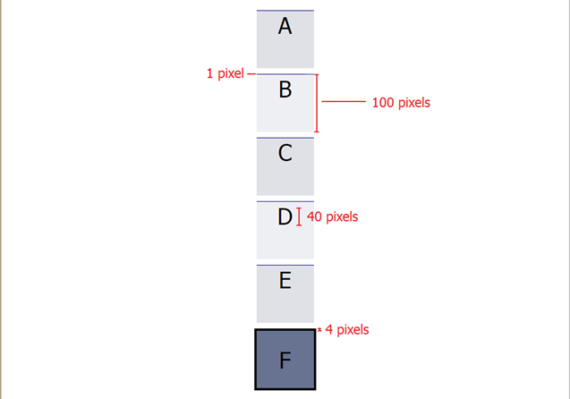
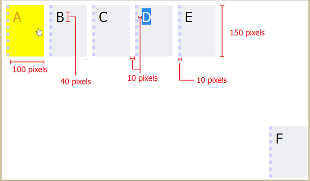
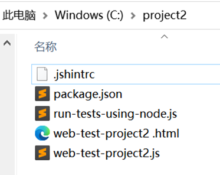
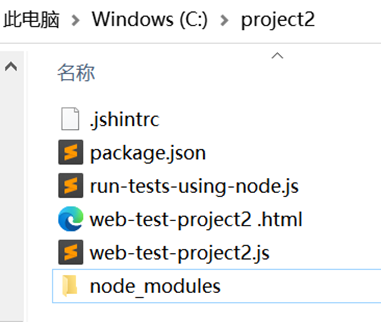
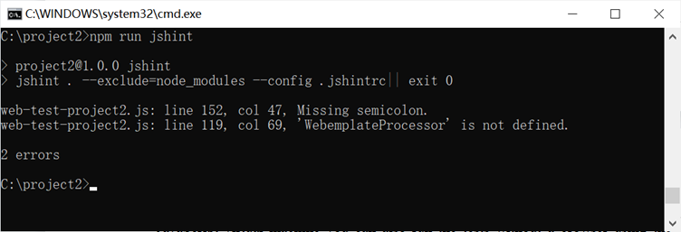
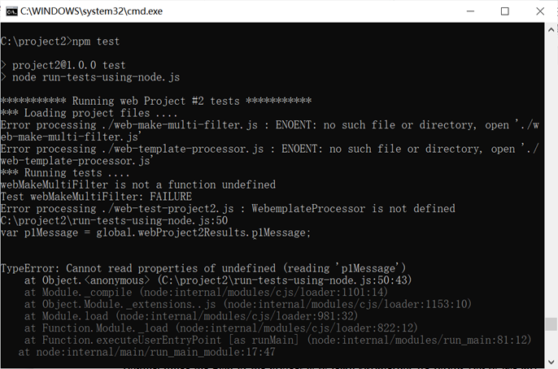

Project 1：HTML & CSS
Problem 1:
Create a single HTML document that presents two different appearances, determined by the document's CSS stylesheet. Your HTML file should be called index.html and the document's title should be "(Web Project #1"). The two stylesheets should be called styleA.css and styleB.css. 
1.If the HTML file links to styleA.css then it should appear like this ("Version A"): 
 

2.If the HTML file links to styleB.css then it should appear like this ("Version B"): 
Note: The D in the screenshot is highlighted to show you what space the text should occupy. Your solution should not style the D with a blue background. 
 

Style A Specifications:
• 	There should be six box elements, lined up vertically. 
• 	All boxes are centered horizontally and equally spaced vertically. When the browser window is resized, the spacing between the boxes should change (they should be equally spaced vertically across the page). However, the boxes themselves should never overlap or change size. 
• 	Each box is 100x100 pixels, with a 1px line (color: #687291) on top. Text is centered horizontally. 
• 	Boxes alternate colors (colors: #dfe1e7, #eeeff2). 
• 	The final element (color: #687291) has a 4px, black border and the text is centered vertically. 
• 	The font in all elements is Tahoma, 40 pixels. 
Style B Specifications:
• 	Five box elements, lined up horizontally in the top left corner. 
• 	Boxes do not wrap with window resizing (i.e. Boxes A through E should stay on the same line even if your browser window is too small to display them all). 
• 	The last box is positioned in the bottom right corner of the window and stays there even when the window resizes. 
• 	Each box is 100x150 pixels (color: #eeeff2), with a 1 Opx dotted line (color: #DO DOFF) on the left. Boxes are separated by 10 pixels of space. 
• 	When hovering over an box, the cursor changes to a hand and the box and font colors change (colors: yellow, goldenrod, respectively). 
• 	The font in all elements is Tahoma, 40 pixels. 
• 	There are 10 pixels of space between the letters and the edge of the box. 
Hints
	You may find some of the following CSS style attributes useful for this project :
display: inline-block; 
height: 100%; 
white-space: nowrap; 
	You will need to use the CSS Flexbox layout 
	Your HTML file must be a valid XHTML 1.0 document that passes validation at http://validator.w3.org. In addition, your HTML and CSS must be clean, readable, properly indented, and well-structured.
Deliverables 
submit all of the files needed for Problem 1, including index.html, styleA.css and styleB.css.
Project 2：JavaScript Calisthenics
Although this project has you run code in your browser, you need to have Node.js installed on your system to run the code quality checker. If you haven't already installed Node.js and the npm package manager, follow the installation instructions now.
Installing Node.js
Install the latest "Long Term Support (LTS)" version of Node.js (currently version 14.16.1). It can be downloaded from the URL https://nodejs.org/en/download. 

To verify you have Node.js and its package manager (npm), try running the commands:
	node -v
	npm -v
which should run and print out the version numbers of your node and npm programs.
Once you have Node.js installed, create a directory project2 and extract the contents of this zip file into the directory. The zip file contains the files web-test-project2.html and web-test-project2.js that act as a testing framework for the code you write in this project. .jshintrc是JSHint的一种配置方式，这种方式允许每个项目有不同的配置文件，只需要将文件放在项目根目录中即可。


You can fetch the code quality tool, JSHint, by running the following command in the project2 directory:
	npm install 
This will fetch JSHint into the node_modules subdirectory. 
 
You will be able to run it on all the JavaScript files in project2 directory by running the command:
	npm run jshint



To run the assignment open the file web-test-project2.html in your browser. The web page will load the JavaScript and run a few tests. Since Node.js also contains a JavaScript virtual machine you can also run the tests without a browser using the command:
	npm test


The JavaScript development environment is much better in the browser so we suggest you do your development using it.
Note: These tests don't cover all the edge cases. They are there to help guide you and let you know when you have the basic functionality. It is your responsiblity to handle everything stated in the following specs that aren't explicitly tested in the test file we give you.
In this project we ask you to write or modify some JavaScript functions. The problems in this assignment are of a practical nature and functionality you develop will be useful in completing later class projects. Given the availability of JavaScript libraries to solve or help solve pretty much any JavaScript tasks you would be assigned, it is likely you could solve these with a couple of lines to call some library routine. Since the goal of the project is to learn JavaScript, we forbid you to use any JavaScript libraries in your solutions. Functions built-in to JavaScript Arrays and Date objects are acceptable.
Problem 1:Generate a Multi Filter Function
In your project2 directory, make a new file named web-make-multi-filter.js.The code for your Multi Filter Function will go in this file.
Declare a global function named webMakeMultiFilter that takes an array (originalArray) as a parameter and returns a function that can be used to filter the elements of this array. The returned function (arrayFilterer) internally keeps track of a notion called currentArray. Initially, currentArray is set to be identical to originalArray. The arrayFilterer function takes two functions as parameters. They are:
1. filterCriteria - A function that takes an array element as a parameter and returns a boolean. This function is called on every element of currentArray and currentArray is updated to reflect the results of the filterCriteria function. If the filterCriteria function returns false for an element, that element should be removed from currentArray. Otherwise, it is left in currentArray. If filterCriteria is not a function, the returned function ( arrayFilterer) should immediately return the value of currentArray with no filtering performed.
2. callback - A function that will be called when the filtering is done. callback takes the value of currentArray as an argument. Accessing this inside the callback function should reference the value of originalArray. If callback is not a function, it should be ignored. callback does not have a return value.
The arrayFilterer function should return itself unless the filterCriteria parameter is not specified in which case it should return the currentArray. It must be possible to have multiple arrayFilterer functions operating at the same time.
Check the function
The following code shows how one might make use of the functions you define in this problem:

```
var arrayFiltererl = webMakeMultiFilter([1, 2, 3]);
arrayFiltererl(function(elem) {
    return elem !== 2; // check if element is not equal to 2 
}, function(currentArray) {
    console.log(this); 
//printing 'this' within the callback function should print originalArray which is [1, 2, 3] 
console.log(currentArray); // prints [l, 3] 
});
arrayFiltererl(function(elem) {
    return elem !== 3;   // check if element is not equal to 3
});
var currentArray = arrayFiltererl();
console.log('currentArray', currentArray)
```

Problem 2:Template Processor
In your project2 directory, make a new file named web-template-processor.js. The code for your Template Processor will go in this file.
Create a template processor class (WebTemplateProcessor) that is constructed with a string parameter template and has a method fillIn. When invoked with an argument of a dictionary object, fillIn returns a string with the template filled in with values from the dictionary object. WebTemplateProcessor should be written using the standard JavaScript constructor and prototype structure.
The fillIn method returns the template string with any text of the form {{property}} replaced with the corresponding property of the dictionary object passed to the function.
If the template specifies a property that is not defined in the dictionary object, the property should be replaced with an empty string. If the property is between two words, you'll notice that replacing the property with an empty string will result in two consecutive whitespaces. Example: "This {{undefinedProperty}} is cool" -> "This is cool". This is fine. You do not have to worry about getting rid of the extra whitespace.
Your system need only handle properly formatted properties. Its behavior can be left undefined in the following cases as we will not be checking explicitly for them.
•	nested properties - {{foo {{bar}}}} or {{{{bar}}}} or {{{bar}}}
•	unbalanced brackets - {{bar}}}
•	stray brackets in any property string - da{y or da}y
The following code shows how one might make use of the functions you define in this problem:

```
var template = 'My favorite month is {{month}} but not the day {{day}} or the year {{year}}'; var dateTemplate = new WebTemplateProcessor(template); 

var dictionary= {month: 'July', day: '1', year: '2019'}; 

var str = dateTemplate.fillln(dictionary); 

assert(str === 'My favorite month is July but not the day 1 or the year 2019'); 

//Case: property doesn't exist in dictionary 

var dictionary2 = {day: '1', year: '2019'};

var str = dateTemplate.fillIn(dictionary2);

assert(str === 'My favorite month is  but not the day 1 or the year 2019'); 
```

Problem 3:fix web-test-project2.js to not pollute the global namespace
The test JavaScript file we give you (web-test-project2.js) declares numerous symbols in the global JavaScript namespace. For example, after the script is loaded the symbol p1Message appears in the global namespace. Another JavaScript file would then be able to access and change p1Message. Change web-test-project2.js to use the standard JavaScript module pattern using an anonymous function to hide symbols in the global namespace yet keep the same checking functionality.
Deliverables 
Submit the project2 directory. This directory should include the starter files we gave you along with code files you created or modified for the problems including web-make-multi-filter.js, web-template-processor.js, web-test-project2.js, and web-test-project2.html. Make sure your submission runs with no errors.

Project 3：Single Page Application
Deliverables 
Accoding to your own like, build a single page application.（可以稍微简单些）
